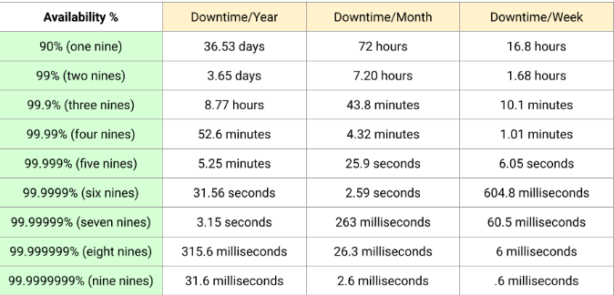

[← Back to all topics](../index.md)

# Availability — Rule of 9s, Fault Tolerance

**Code:** No code for this project.

A dependency-free simulation demonstrating the CAP trade-off using two independent
5-node clusters — one tuned for consistency (CP), one tuned for availability (AP).

## Theory

Availability of a distributed system is the percentage of time in a given period that a system is available to perform its task and function under normal conditions.  
Because there are various nodes amongst various components in a distributed system, the system needs to remain operational despite failures within its components

**<u>How resistant a system is to failure</u>**  
An example of a system that has high availability would be Air Traffic Control, because a single error in directing aeroplanes can have catastrophic results.

That being said, systems that are not vulnerable to failures can work well with fewer availability requirements. Higher availability comes at a cost.

### How is Availability measured

Availability = Uptime / (Uptime + Downtime)

### How to achieve high Availability

**Redundancy** - duplicating or adding components (servers or storage).  
A system with 2 identical web servers behind a load balancer can continue operating even if one of the servers goes down because the load balancer can redirect traffic to the remaining server. By adding redundancies we can make the system more resilient to failures

**Passive Redundancy** - Only some of the components are active while the others are not but they are waiting for a failure on the active components end so they can take over and become active.
This is also known as active-passive because one is active

**Active Redundancy** - Multiple active components work simultaneously to perform a task. In the event of a failure of one of the active components, the other active components take over.
This is also known as active-active because they’re all active

### Failure detection and alerting

Continuously monitor system health and regularly perform high-availability testing, so that we can take corrective action whenever one of the components in the system becomes unavailable.

**<u>Heartbeat</u>** - active components periodically send a “ping” or status message to a central monitor. If a heartbeat stops for a set window, the window is declared dead.

**Health Check Endpoints** - load balancer constantly poll nodes on GET/health.
This verifies that the application server is running and returning a 200 OK
Verifies that downstream dependencies (database connection, redis cache, disk space) are functional

### Other strategies

**Load Balancer** - you can use load balancer to prevent a single server overloading.  
**Automatic fail-over** - if a server dies, another one immediately takes its place (This is the mechanism in the active-passive/active-active architectural layout)  
**Replicate Data** - replicating data across multiple locations helps avoid outages and makes the system resilient against disasters. Replication can be synchronous, asynchronous  
**Disaster Recovery** - If a system dies or a disaster occurs, what is the recovery plan to take its place.

Understand there is a trade-off to the availability of a system and its performance. To achieve high availability, we can implement redundancies and disaster recovery plans, though as a result it can lower system performance (higher latency, and lower throughput). When you implement redundancy strategies you replicate data/tasks across multiple resources which increases latency.

### Fault Tolerance

Not to be confused with Availability, **Fault Tolerance** is the system’s ability to continue functioning even when a failure occurs in the system.
Availability is about the system’s ability to remain operational and reduce downtime.

Fault tolerance is when a lot of systems run in parallel that way in the event of a failure another system can take over without having downtime.
