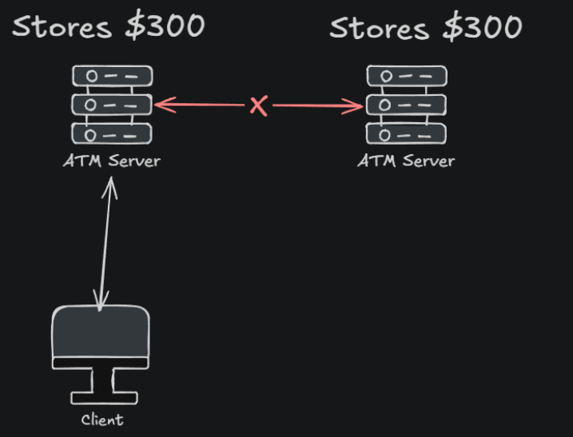
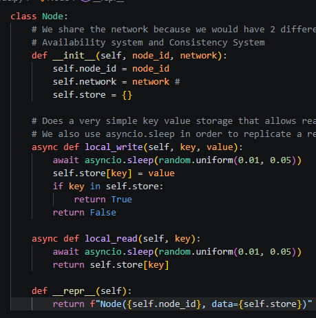
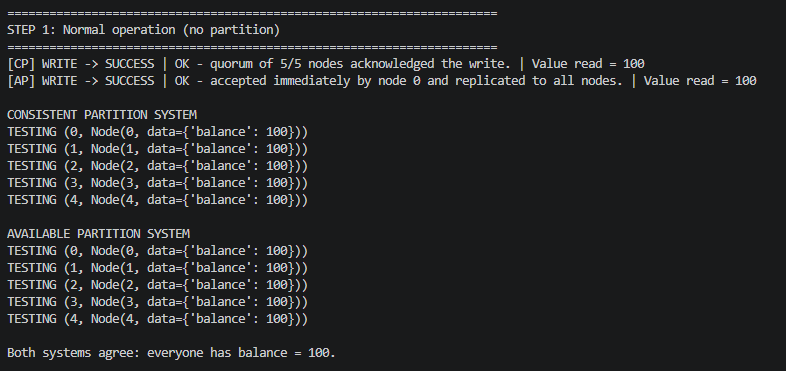
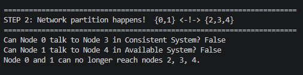
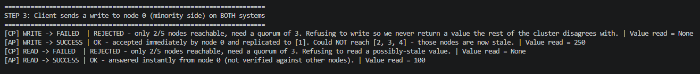
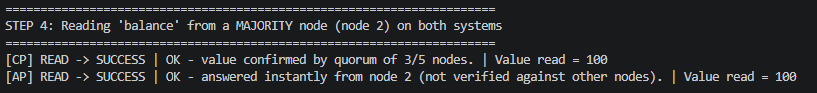
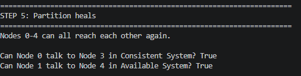
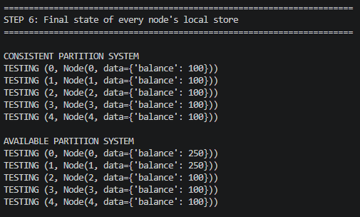

[← Back to all topics](../index.md)

# CAP Theorem — Consistency vs. Availability

**Code:** [CAP Theorem Demonstration](https://github.com/eitancohen77/CAP-Theorem)

A dependency-free simulation demonstrating the CAP trade-off using two independent
5-node clusters — one tuned for consistency (CP), one tuned for availability (AP).

## Theory

### CAP THEOREM BY ERIC BREWER

Let's say we have a distributed system. In this example our distributed system is a network of ATM machines. And these machines have a failure between the 2 of them causing them to not be able to communicate and pass information. This is called a Partition - When a network failure happens between 2 components of a distributed system.

- If you make write operations to one of the server, the other one would not know the operations happening.

The theory behind **CAP** is the system can now make a choice. Either offer Consistency, or offer Availability. BUT YOU CAN NOT DO BOTH.

## Consistency Design

For the example above, consistency would be if the user wants to pull money out of the ATM the system will tell him sorry I can’t do that because there is a system failure and i cant communicate with other networks.

**Advantages**

- This keeps the data safe. No other user can access anything right now because you are guarding the data

**Disadvantages**

- User can't access the system because you can’t afford changes to the data with system down. This means there is downtime.

## Availability Design

Here, the user can make changes with the working ATM, and when the broken ATM gets fixed and the communication is back up it will be updated with all the changes.

**Advantages**

- Offers availability. Users can interact with the system and its usable

**Disadvantages**

- Can be risky because if a system is down and you are making changes which would result in 2 different nodes/components that aren't communicating with each other so they have differing views on data.

If data is changed and nodes can't communicate with each other, then one node has different data. To know which data is accurate and which one needs updating, you use a hinted handoff.  
**Hinted Handoff** - temporarily stores data on a reachable node when the intended node is down, ensuring data is eventually transferred to the correct node once it's back online.

## Quorum

**Quorum** - Refers to a subset of nodes in a distributed system that must agree on a specific decision or action for it to be considered valid. This is usually a consistent feature. This is also called configurable quorum because we can adjust the number of healthy communicative nodes that are running.
The minimum number of nodes/components in a distributed system that are required to reach a decision on a specific action.

Lets say for example you have 6 nodes in a machine. You can set up a quroum rule that states need 5 nodes in this machine to be able to communicate with each other in order to proceed with communications. The quorum in this case would be 5.

### Quorum in Consistency Design

ensures consistency by requiring a majority of nodes to agree on an operation before its run. This prevents inconsistencies that can arise when different nodes have different views on the data.

### Quorum in Available Design

Now a true Available system would not need a quorum because so long as one node works it doesn't matter. An example of this is [Cassandra consistency level one](https://www.baeldung.com/cassandra-consistency-levels). If you require a quorum for every request, you’ve built a Consistent Partition system, because refusing to serve a minority partition is a consistent behavior.

# Coding Demonstration:

### Say I have the following node class that can simply read and write operations:

### I create 2 network systems. A consistent system and a available system with the same number of nodes holding the same amount of information:

### I create a partition. So now node goup {0, 1} cannot communicate with group {2, 3, 4} on both Consistent and Available systems:

### Write operation on a minority side:

### Read operation on a majority side:

### Partition heals. Communication between group works again

### Final state of both Systems:

## What this demonstrates

The AP nodes are still divergent (node 0/1 = 250, node 2/3/4 = 100). Healing the network doesn't fix this by itself -- an AP system needs an explicit reconciliation strategy to converge. That reconciliation step is intentionally left out here so the divergence is easy to see.

SUMMARY

CP system : during the partition it REJECTED the write and the read
request whenever a quorum wasn't reachable. Every answer
you got from it was guaranteed correct, but sometimes it
gave you no answer at all.

AP system : during the partition it ACCEPTED every request instantly,
no matter which node you happened to hit. It was always
available, but two different nodes could give
you two different answers to the same question even IFF there is only one node available with the others partitioned

That trade-off -- give up availability to keep consistency, or give
up consistency to keep availability, whenever a partition happens --
is exactly what the CAP theorem describes.
