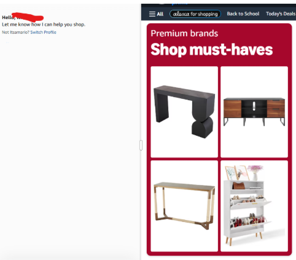
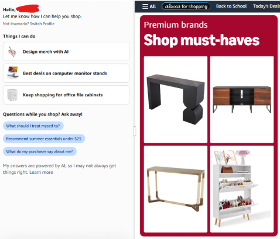
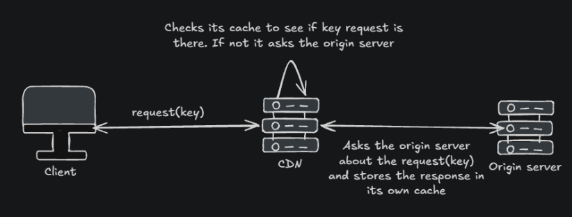
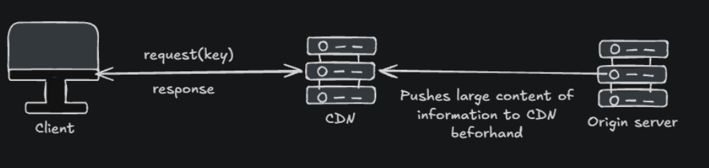

[← Back to all topics](../index.md)

# Content Delivery Network

**Code:** No code for this project.

## Theory

## CDN

**Content Delivery Network** - geographically distributed network of **proxy servers** (or edge servers), designed to deliver web content to users faster and more reliably by serving it from locations closer to them.

Lets say you have a user in tokyo that wants to access your site. What you can do is give him files (photos, videos, CSS stylesheets, JS code) before you send him the interactive features of your site.

Say in instagram’s case as an example. When you open up instagram, you notice that there is a slight delay when looking at photos/reels. The reason why is because the CSS is there and the homepage is there but the photos from the database haven't arrived yet so there is a slight delay.

amazon a better example:

- As you notice on the left hand side there is a slight delay. This is because it takes a while for the interactive requests to come on whereas the cdn pushes all the css html javascript files to the user.
- The navbar, and apis push/pull the cdn from are already there on the first picture

There are 2 types of cdns

### Pull CDN

Leaves all your files on your origin servers. It pulls content to the edge server only when a user actually asks for it.

Say you have a user in London.

1. The user requests [example.com/logo.png](https://example.com/logo.png)
2. The local london CDN node checks its cache and sees a Cache Miss - when the cache doesn't have the needed key
3. The CDN node reaches out to your origin server, pulls a copy of logo.png, caches it locally and delivers it to the user
4. The next user in london who requests logo.png gets a Cache Hit (when the cache has the needed key) directly from the CDN edge with zero trips to the origin server

**Advantages**

- **Low Storage Usage** - Caches only recently requested, popular content
- **Low Maintenance** - Set time-to-live (TTL) headers and walk away
  Disadvantages
  Could be slower - If there is a cache miss, it would take time to send a request/response to origin server

**When to use**
For modern web applications, e-commerce stores, news sites, and frequently updated sites

### Push CDN

Treats the edge servers like a remote cloud storage bucket. Instead of waiting for user requests, you manually or programmatically push files directly to the CDN’s network bucket beforehand.

1. Your build pipeline/script finishes generating a release asset (video file or mobile app installer)
2. You trigger an API or script that pushes that file to all CDN edge locations worldwide before launch
3. When the first user in London requests the file, it is already waiting on the edge node.

**Advantages**

- **Fast** - All data is located in CDN. No need to send a request to origin server
  **Disadvantage**
- **High Maintenance** - You must manually handle file deletions and version updates
- **High Storage** - Everything you push whether users request it frequently or not.

**When to use**
Very large files, OS patches, video game updates, or static assets that change predictably and rarely.
