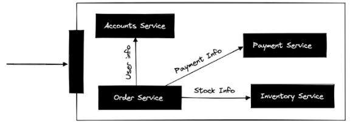
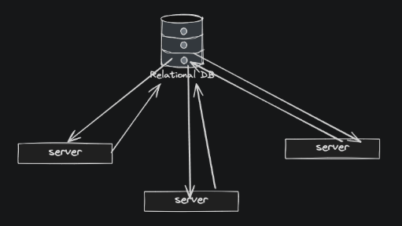
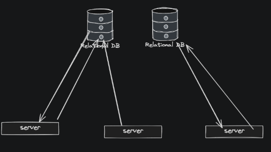
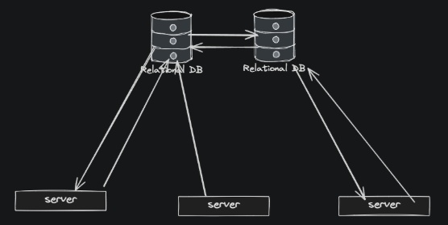
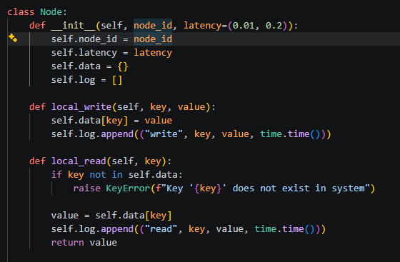

[← Back to all topics](../index.md)

# Consistency Patterns— Weak, Eventual and Strong

**Code:** [Consistent System Demonstrations](https://github.com/eitancohen77/Consistent-Systems)

## Theory

### Distributed System

**Distributed System** - a System that consists of more than one parts/component/nodes and each component is responsible for a part of the application.

- A system where the components are located in different networked computers, but they communicate and coordinate their actions by passing messages to each other. These components interact with each other to achieve a certain goal.

A server can be a component, database, load balancers, etc.

**<u>Example of a Distributed System</u>**  
Let's say we have an e-commerce application that sells books. This application can have multiple different components. A server can be responsible for accounts, while another server can be responsible for payments, a different server can be responsible for storing orders, for loyalty points, etc.

Now lets say a user buys a book. There can be different services involved in placing the order.
user_buys_book() can have these services
order_service()
payment_handling()
inventory_space()



## PACELC

In CAP Theorem if a partition happens you need to choose between availability and consistency. However when a system runs fine, the designer needs to choose between Latency and Consistency.  
**P - A / P - C** - (Partition behavior) If the network breaks, do you stay available with outdated data or stop to stay consistent  
**E - L / E - C** - (Else normal Behavior) When the network is healthy, do you reply fast with lower consistency, or wait for all replicas to update for strict consistency.

## Consistency

When working with distributed systems, there needs to be a plan in handling and managing the data across different servers. Lets say with the example above, if we have 2 users looking at a book and one bought it before the inventory_space() service can happen. Now we have a user looking at a book that has already been bought and we will have the wrong stock information. This is where different consistency patterns come in

**<u>Consistency Patters</u>**  
The way in which data is stored and managed in a distributed system and how the data is made available to the users. There are 3 main types of consistency data with pros and cons to all

### Strong Consistency

  
In a Strong Consistency system, any updates to some data are immediately sent to all locations in the system. This makes sure that all components and locations have the same version of the data, but this also means that the system is not highly available and has high latency.

This would also mean that the way you handle requests would be different because some requests would have hierarchy and priority over others.

An example of strong consistency is a financial system where users can transfer money between accounts. This system is designed for high data integrity - which means the data needs to be as accurate as can be. This means the data needs to be stored in a single location and updates to that data are immediately transferred to all other locations.

- It would be the single point of location for the data.

### Weak Consistency


Updates to the data may not be immediately transmitted (propagated). This can lead to inconsistencies and conflicts between different versions of the data, but it allows for high availability and low latency.
A read operation may not guarantee the return of the most recent write.

An example of weak consistency is the viewing button on a youtube video. For every person watching that video the server sends a write request to the database to update that video +1 for view count. Not to mention the other requests wanting to watch that video. Because it stacks up you need to give “somewhat accurate” data for the view count so you give weak consistency

### Eventual Consistency

  
This is a type of weak consistency.
Here data is stored in multiple locations and updates to that data are eventually propagated to all locations. This gives the system high availability and low latency, but there could also be inconsistencies and conflicts between different versions of the data.
Replicas of a node are temporarily out of sync, but guaranteed to match “eventually” if no new updates occur.

The difference between a weak consistency and an eventual consistency is eventual consistency guarantees that if no new updates are made to a data item, all replica nodes will “eventually converge” and return the same value.

## Watching it run

Since this is a live multi-node simulation, here's what an actual run looks like
rather than a live demo:

### Say I have a node class And these these node classes are each a server that contain identical information when they are bootstraped. These nodes hold book information:



```
======================================================================
                          STRONG CONSISTENCY
======================================================================
  Single source-of-truth node. Every write is synchronously
  pushed to all nodes - and every read is confirmed against
  the primary - before returning. Slower, but never wrong.

----------------------------------------------------------------------
 Timed write
----------------------------------------------------------------------
  write() elapsed:                      0.157s
  Converged after write?                True

----------------------------------------------------------------------
 Race: two users buy the last copy of A Game of Thrones (stock=1)
----------------------------------------------------------------------
  user_2:                               success=False, 0.000s
  user_1:                               success=True, 0.138s
  Exactly one buyer won?                True
  Nodes converged?                      True
======================================================================
                         EVENTUAL CONSISTENCY
======================================================================
  Writes return immediately, no coordination, no lock.
  Propagation happens in the background and is GUARANTEED
  to arrive eventually - but two concurrent writes can each
  succeed against stale local data before that happens.
----------------------------------------------------------------------
 Timed write
----------------------------------------------------------------------
  write() elapsed:                      0.057s
  read() from B right after:            stock=3 (0.069s)
  Converged yet?                        False

----------------------------------------------------------------------
 Race: two users buy the last copy of A Game of Thrones (stock=1)
----------------------------------------------------------------------
  user_1 (via A):                       success=True, 0.094s
  user_2 (via B):                       success=True, 0.094s
  Both succeeded (oversold)?            True

----------------------------------------------------------------------
 Nodes BEFORE background propagation finishes
----------------------------------------------------------------------
    A: stock=0
    B: stock=0
    C: stock=0
  Converged?                            True

----------------------------------------------------------------------
 Background propagation
----------------------------------------------------------------------
node_id synced 'key' in elapsed seconds
node_id synced 'key' in elapsed seconds
node_id synced 'key' in elapsed seconds
node_id synced 'key' in elapsed seconds
  Time to converge after write():       0.074s

----------------------------------------------------------------------
 Nodes AFTER convergence
----------------------------------------------------------------------
    A: stock=0
    B: stock=0
    C: stock=0
  Converged?                            True

  Note: convergence only means the nodes now AGREE - it does
  NOT mean the value is correct. The book is still oversold.

======================================================================
                       SIDE-BY-SIDE COMPARISON
======================================================================
                      STRONG              EVENTUAL
  ------------------  ------------------  ------------------
  Write speed         0.157s              0.057s
  Book oversold?      False               True
  Ends up converged?  True                True
```

## What this demonstrates

Eventual's write was ~2.7x faster than strong's.
But strong is the only one of the two that never oversells -
eventual trades that guarantee away for speed, and only
promises the nodes will agree eventually, not that they'll
agree on something CORRECT.
