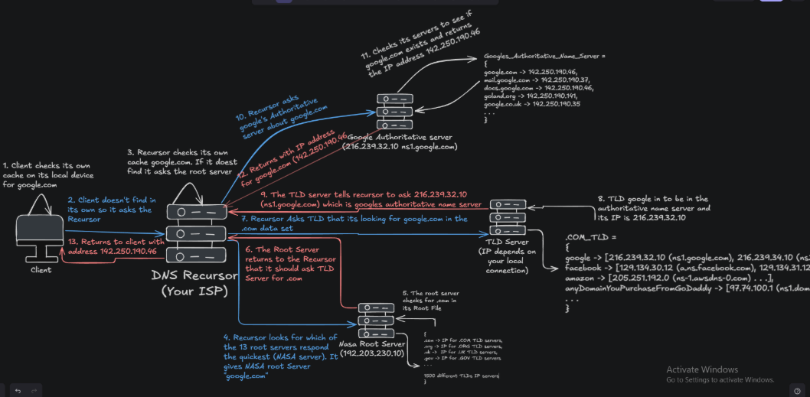
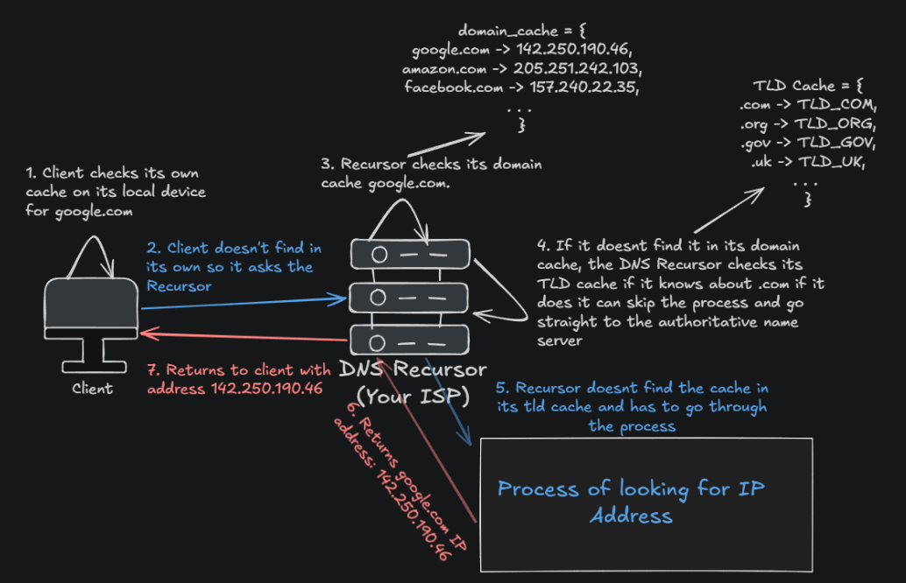
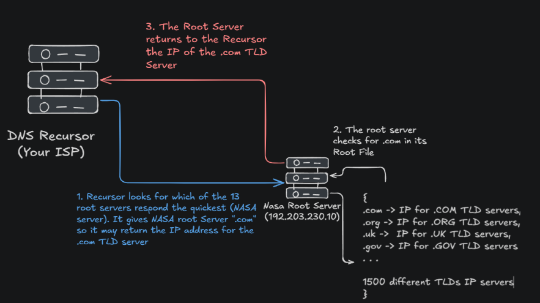
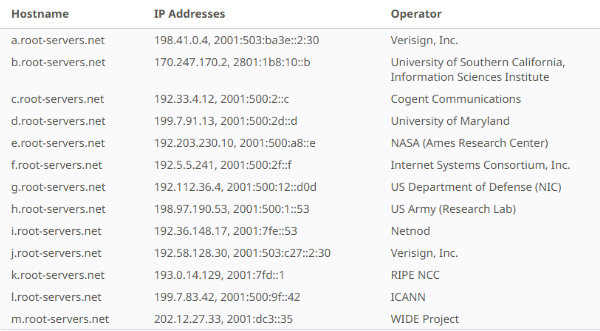
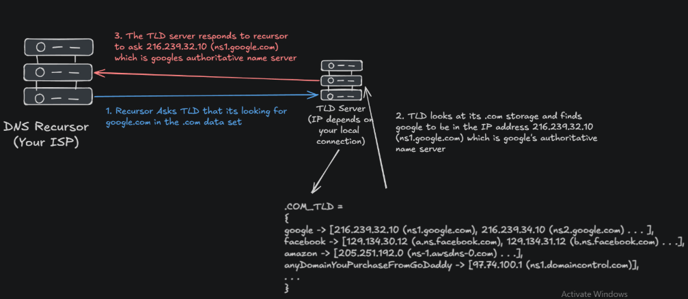
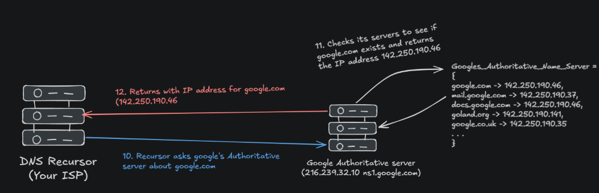
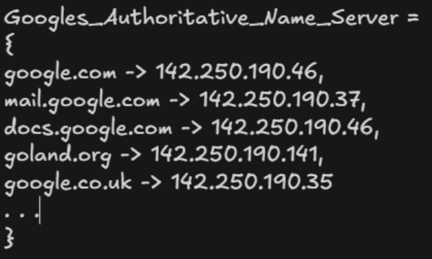

[← Back to all topics](../index.md)

# Domain Name System

**Code:** No code for this project.

## Theory

## Domain Name System

The “Phonebook” of the internet. Each device connected to the internet has a unique IP address which other machines use to find the device. DNS servers eliminate the need for humans to memorize IP addresses.
Instead of remembering [142.251.45.78](http://142.251.45.78) you could just remember [Google](https://www.google.com/).

The process of DNS resolution involves converting a hostname (www.example.com) into a computer friendly IP address such as 192.168.1.1. An IP address is given to each device on the internet, and the address is necessary to find the appropriate internet device. When a user wants to load a webpage, a translation must occur from what the user typed into their web into the machine friendly address that is used to locate the example.

Now the first thing that comes to head is oh so its a massive hashmap that can detect domains and translate them into IP. No, not so simple. There are 350 million domains in the world right now. That means the map has to be 350 million large and would require trillions of requests per second. This system would fail for so many reasons. Let's say you replicate it to lessen the requests, now you're replicating a database with 350 million entries. There is a more efficient way to do this.
There are 4 DNS Servers involved in loading a webpage

### DNS recursor

This is the server you (or your Internet Service Provider) talk to directly. When you type google.com, your computer sends a request to the Recursor. It looks it up in its local cache. If it doesn't find it, it begins the search by contacting the other 3 servers on the list. Note it can skip some of the processes by looking at its TLD cache.

### Root Server

There are 13 logical IP addresses (spread across thousands of physical locations/servers) that act as the directory for the whole internet. What they do is they don't know the IP address but they do know that it ends with .com.  
**TLD** - Top Level Domain - The root server can see that google.com ends with .com so it sends the request to a server that has a mapping of all the .coms. So for example if it has a .gov then it would send the request to the .gov TLD server.

There are 13 organizations that run 13 different IP addresses that handle the root server. These 13 IP addresses have hundreds of facilities around the world that help you connect to the root server.

- The way its done is these facilities have servers that can only answer to that unique IP address

The whole job of the Root server is to find what the TLD of a search is. The way they do this is each of the 13 IP addresses have the Root zone File which is identical amongst all 13. Its a file that holds all the TLDs servers and how to find them:

So the Root server would respond to the recursor saying “I don't know where google.com IP address is” but here is the IP for the .com TLD server you can go ask them

### TLD Servers

Top Level Domain - The server responsible for specific domain extensions like .com, .org, .uk.
It receives a request from the root server (where is google.com info). The TLD server responds by pointing the Recursor to the specific Authoritative Nameserver that Amazon actually owns and controls

2 Things to notice here

1. **Why is there multiple IP addresses for the Authoritative names?**  
   Reason why is because in case ns1.google.com doesn't work or has high latency, the recursor can redirect to ns2.google.com

2) **Why are they named ns1.google.com and not just the IP?**  
   Reason why is because IP addresses can change, but the name of the server belongs to them. So they can change their IP addresses and continue the workflow by referring to ns1.google.com.

### Authoritative Name Server

After the recursor got the information from the TLD server that the IP address is google’s authoritative name server, the recursor asks google if they know of this information: google.com and the ANS looks at its map and finds the correct IP address.

