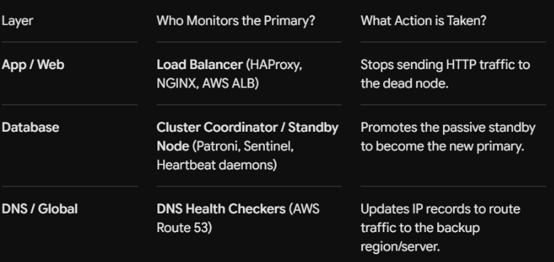
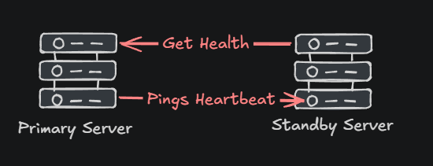
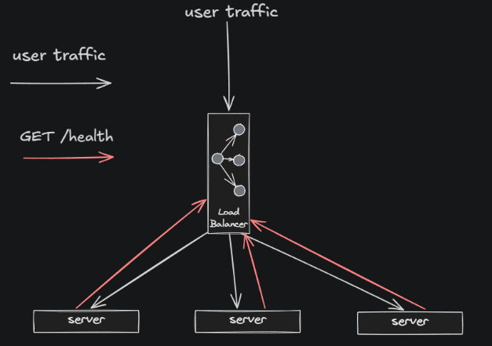

[← Back to all topics](../index.md)

# Failover — Active-Active vs Active-Passive

**Code:** [Failover Demonstration](https://github.com/eitancohen77/Availability-Failover)

A dependency-free simulation demonstrating the CAP trade-off using two independent
5-node clusters — one tuned for consistency (CP), one tuned for availability (AP).

## Theory

**Fail-over** is an availability pattern that is used to make sure the system can continue to function if a failure happens. It involves having a backup node that can take over when the failure happens.

- Not to be confused with CAP. In CAP we have a partition failure in which systems/nodes can’t communicate with each other.

In a failover system, there is a primary node that is responsible for handling requests and a secondary node that is there on standby. The primary node is monitored for failures by a handling component. Depending on the system you have can depend on what handling component you need:



- Load balancer would redirect HTTP traffic to an alive node on standby

There are 2 ways in which standby nodes can interact with the active node.

### Active-Passive



One server actively handles all tasks while a secondary server stays in standby mode, monitoring the primary server’s health.  
If the primary server fails or stops responding, the system detects the issue almost instantly then brings the standby server and becomes active by taking over the primary server’s IP addresses. This failover process usually takes anywhere between 30 to 60 seconds.

To ensure consistency between the nodes, active-passive setups use database replication, file synchronization, or shared storage. In some cases both servers can even have the same data repository which would get rid of the need for constant synchronization between the two.

#### Benefits

**Higher Consistency** - You know there is a backup server waiting on standby in case something happens to the primary  
**Simpler** - clear division between the active and standby node minimizes confusion during emergencies or maintenance. Each server has a well-defined purpose making it easier to manage and troubleshoot  
**Cost saving** - Only one server handles workloads at a time, so the standby server can use less powerful hardware.  
**Predictable transitions** - We know exactly which server will take over in the case of a failover  
**Resource separation** - since only one server is active at a time, there’s no risk of data corruption from simultaneous writes or conflicts from other nodes.

Overall the theme with active-passive is that it delivers higher consistency

#### When to use

Financial trading systems, emergency response tools, and healthcare management software rely on active-passive failover for dependable performance without the complexity of multiple servers that can lead to inconsistencies

### Active-Active


Involves deploying multiple nodes that handle traffic simultaneously, sharing the workload equally. Unlike active-passive systems where backup serves sit idle, every server in an active-active setup is operational and contributes to traffic management.

Load balancer plays a critical role here, monitoring server health and instantly redirecting taffic if one server goes down. This eliminates the delay seen in active-passive setups, where a standby server has to be activated.

In practice users rarely notice when a serve fails. Their requests are unknowingly redirected to a healthy server making active-active configuration a go to solution for businesses that prioritize availability and uptime.

### Benefits

**Continuous availability** - Because nodes run in parallel, the system can tolerate the failures of one orr more nodes with no downtime. Service remains available to users even if a server or an entire site goes offline.
**High Scalability** - Straightforward to scale by simply adding more nodes. As workload increases, new servers can be introduced to share the load.
**Load Balancing and performance** - workloads are load-balanced across active nodes, preventing any single node from an overload.
**Geographic Distribution** - Supports multiple data centers which provides geographic redundancy.

**Use active-active if you want high availaiblity**

## Watching it run

Since this is a live multi-node simulation, here's what an actual run looks like
rather than a live demo:

```
$ python3 main.py
[Normal operation] CP cluster: balance=100 across all 5 nodes
[Normal operation] AP cluster: balance=100 across all 5 nodes

[Partition introduced] nodes {0,1} cut off from {2,3,4}

[Write balance=250 to node 0, both systems]
  CP → REJECTED (only 2/5 nodes reachable, quorum=3)
  AP → ACCEPTED (node 0 updated, replicated to node 1 only)

[Read from majority node 2]
  CP → 100 (quorum-confirmed)
  AP → 100 (node 2's local value — node 0 is silently at 250)

[Partition healed]

[Final state]
  CP cluster: all nodes read 100 (nothing to reconcile)
  AP cluster: nodes 0,1 read 250 — nodes 2,3,4 read 100 (diverged, unresolved)
```

## What this demonstrates

- Quorum-gating and unconditional availability are mutually exclusive by definition
- An AP system needs an explicit reconciliation strategy (last-write-wins, vector
  clocks, CRDTs, read-repair) to converge after a partition heals — healing the
  network alone doesn't fix it
