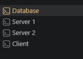

[← Back to all topics](../index.md)

# Failover — Active-Active vs Active-Passive

**Code:** [Failover Demonstration](https://github.com/eitancohen77/Availability-Failover)

A dependency-free simulation demonstrating active-passive fail over with the theory behind it.

## Theory

**Fail-over** is an availability pattern that is used to make sure the system can continue to function if a failure happens. It involves having a backup node that can take over when the failure happens.

- Not to be confused with CAP. In CAP we have a partition failure in which systems/nodes can’t communicate with each other.

In a failover system, there is a primary node that is responsible for handling requests and a secondary node that is there on standby. The primary node is monitored for failures by a handling component. Depending on the system you have can depend on what handling component you need:


- Load balancer would redirect HTTP traffic to an alive node on standby

There are 2 ways in which standby nodes can interact with the active node.

### Active-Passive


One server actively handles all tasks while a secondary server stays in standby mode, monitoring the primary server’s health.  
If the primary server fails or stops responding, the system detects the issue almost instantly then brings the standby server and becomes active by taking over the primary server’s IP addresses. This failover process usually takes anywhere between 30 to 60 seconds.

To ensure consistency between the nodes, active-passive setups use database replication, file synchronization, or shared storage. In some cases both servers can even have the same data repository which would get rid of the need for constant synchronization between the two.

#### Benefits

**Higher Consistency** - You know there is a backup server waiting on standby in case something happens to the primary  
**Simpler** - clear division between the active and standby node minimizes confusion during emergencies or maintenance. Each server has a well-defined purpose making it easier to manage and troubleshoot  
**Cost saving** - Only one server handles workloads at a time, so the standby server can use less powerful hardware.  
**Predictable transitions** - We know exactly which server will take over in the case of a failover  
**Resource separation** - since only one server is active at a time, there’s no risk of data corruption from simultaneous writes or conflicts from other nodes.

Overall the theme with active-passive is that it delivers higher consistency

#### When to use

Financial trading systems, emergency response tools, and healthcare management software rely on active-passive failover for dependable performance without the complexity of multiple servers that can lead to inconsistencies

### Active-Active


Involves deploying multiple nodes that handle traffic simultaneously, sharing the workload equally. Unlike active-passive systems where backup serves sit idle, every server in an active-active setup is operational and contributes to traffic management.

Load balancer plays a critical role here, monitoring server health and instantly redirecting taffic if one server goes down. This eliminates the delay seen in active-passive setups, where a standby server has to be activated.

In practice users rarely notice when a serve fails. Their requests are unknowingly redirected to a healthy server making active-active configuration a go to solution for businesses that prioritize availability and uptime.

### Benefits

**Continuous availability** - Because nodes run in parallel, the system can tolerate the failures of one orr more nodes with no downtime. Service remains available to users even if a server or an entire site goes offline.
**High Scalability** - Straightforward to scale by simply adding more nodes. As workload increases, new servers can be introduced to share the load.
**Load Balancing and performance** - workloads are load-balanced across active nodes, preventing any single node from an overload.
**Geographic Distribution** - Supports multiple data centers which provides geographic redundancy.

**Use active-active if you want high availaiblity**

## Code Demonstration

### Here I have 4 servers nodes.



**Database** - which is a server that holds data  
**Server A** - The active server (http://localhost:8001)  
**Server B** - The standby server (http://localhost:8002)  
**Client** - A Client that can use read/write operations

### The two server nodes are set up to do read/write operations:

```
class Node:
    def __init__(self, node_id, port, role, inventory_port, primary_port=None, check_interval=5):
        self.node_id = node_id
        self.port = port
        self.role = role
        self.primary_port = primary_port
        self.inventory_port = inventory_port

    def parsed_for_inventory(self, method, path, data=None):
        . . . # Not important

    # Write operation to POST in database
    def write_books(self, book_id, author, stock):
        result = self.parsed_for_inventory(
            "POST", "/write", {"book_id": book_id, "author": author, "stock": stock}
        )
        return result

    # Read operations to GET from database
    def read_book(self, book_id):
        result = self.parsed_for_inventory("GET", f"/read?book_id={book_id}")
        return result

    def read_all_books(self):
        status, result = self.parsed_for_inventory("GET", "/read_all")
        return status, result  # return BOTH -- do_GET needs the status too

    def is_primary_alive(self):
        # This attempts to ping the primary node
        try:
            request.urlopen(f"http://localhost:{self.primary_port}/ping", timeout=2)
            return True
        except error.URLError:
            return False

```

- **The is_primary_alive()** function is a heartbeat mechanism function that pings the primary node every **check_interval** time. In this case its every 5 seconds

### I make a write operation from Client which is carried out by server A:

```
> write b14 JRR Tolkien 4
 (answered by http://localhost:8001)
```

### I activate server B:

**Server B:**

```
B Server runnning on http://localhost:8002
```

**Server A:**

```
127.0.0.1 - - [19/Aug/2026 19:35:20] "GET /ping HTTP/1.1" 200 -
127.0.0.1 - - [19/Aug/2026 19:35:27] "GET /ping HTTP/1.1" 200 -
```

- As we can can see this is the heartbeat mechanism. Server A is getting a GET request from server B for a heartbeat.

### I stop server A from functioning.

**Server A:**

```
127.0.0.1 - - [19/Aug/2026 19:36:58] "GET /ping HTTP/1.1" 200 -
127.0.0.1 - - [19/Aug/2026 19:37:05] "GET /ping HTTP/1.1" 200 -

A Shutting down
```

**Server B:**

```
[B] Primary node is not responding. TAKING OVER AS ACTIVE!
```

- Server B does not get a heartbeat back from server A and assumes its dead and takes over.

### Server B plays the same role as server A (because they are both identical)

**Client:**

```
> read b14
 (answered by http://localhost:8002)
{'book_id': 'b14', 'author': 'JRR Tolkien', 'stock': 4}
```

- The client can still do read/write operations and remembers the information done on server A because its stored in a database even though server 1 failed and crashed.

### Server A comes back to life

**Server A up and running again:**

```
A Server runnning on http://localhost:8001
127.0.0.1 - - [19/Aug/2026 19:41:33] "GET /ping HTTP/1.1" 200 -
```

**Server B steps down**:

```
[B] Primary node is back up and repsonding. STEPING DOWN FROM ACTIVE!
```

**Client goes back to requesting server A**:

```
read_all
(answered by http://localhost:8001)
{'count': 1, 'books': {'b14': {'author': 'JRR Tolkien', 'stock': 4}}}
```

## What this demonstrates

## What this demonstrates

- Active-passive failover keeps the system available through a real failure — the client never has to know Server A died; it just keeps issuing reads/writes and gets served by whichever node is currently active.
- The heartbeat is what makes failover possible in the first place: Server B only takes over because it _detects_ Server A's silence, not because anything tells it directly that A crashed.
- Because both servers read/write through the same shared Database rather than holding their own local state, Server B can serve Server A's data immediately on takeover — there's no replication lag or missing-data window to work around here.
- Failback isn't automatic just because Server A comes back online — Server B has to _notice_ A is alive again and voluntarily step down. Without that check, you'd end up with both servers thinking they're active at the same time (split-brain), which is exactly the kind of failure mode a real failover system has to guard against.
