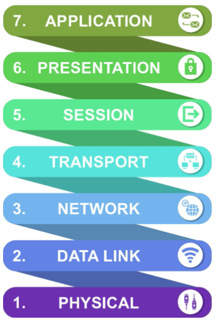
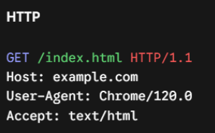

[← Back to all topics](../index.md)

# Networking Layers

**Code:** No code for this project.

# Theory

## OSI Model

**Open System Interconnection Model** - Conceptual framework that reeks down network communication into 7 distinct layers.

The industry uses 3 primary conceptual frameworks to standardise this process: Layer 7 (application) Layer 4 (Transport) and layer 3 (Network).

  
<i>The 7 Layers of the OSI Model. Source: Maccow Creatives / Getty Images</i>

### Layer 7 Application Layer

Sits at the very top of the OSI model. It acts as the direct bridge between end-user applications and the underlying network architecture.

It has a set of rules which all OS must follow. This is how a Google Chrome running on macOS and a NGINX web server running on Ubuntu Linux can exchange complex messages seamlessly without caring about each other’s internal software structure.

**Key Functions**  
**Service Authorization & Authentication** - Verifies the user or app’s identity and checks permissions before allowing remote communication  
**Syntax and Protocol Identification** - Determines which protocol (HTTP, FTP, SMTP) applies to the incoming or outgoing user request  
**Network Resource Allocation** - Identifies whether network resources are available to handle a requested file, remote session, or message  
**Error Recovery at the App Level** - Handles application-specific errors (EX: generating “404 NOT FOUND” status code when a web page is missing

**Step by step of Layer 7**

1. User Action - You hit enter in Chrome
2. Layer 7 Request Construction - The browser relies on HTTP/HTTPS (Application Layer Protocol) to compose a plain-text structured request:

3. DNS - the browser uses another Layer 7 protocol, DNS, to lookup the IP address for example.com

4) Handoff Down the Stack - Layer 7 hands this structured HTTP message down to Layer 6 (Presentation) to encrypt it via TLS, and then to layer 4 (Transport) to send it out via TCP
5) Server Processing - When the server receives the raw data, it processes it back up to Layer 7, reads the GET /index.html command and sends back an HTTP response header (EX: 200 ok) along with the HTML file.

### Layer 6 Presentation Layer

This layer acts as the network’s translator, security agent, and data optimizer. Without Layer 6, applications on different devices would send data in incompatible formats or in plain text over the internet, leaving it completely unreadable or exposed to hackers.

Computers don't all speak the same language. A windows machine, Mac, or Android phone might represent text, numbers and file formats differently. Layer 6 solves format incompatibility and security risks. It ensures that data sent from Layer 7 of the sending system is prepared, formatted and secured so that Layer 7 on the return system can read it without error, regardless of hardware or operating system differences.

**Key Functions**  
**Data Translation** - Converts data between application-specific formats and standard network formates

- Translating ASCII to EBCDIC or converting JSON/XML for web APIs

**Data Encryption and Decryption** - Handles cryptographic protocols (SSL/TLS) so sensitive data stays secure in transit  
**Data Compression** - Shrinks large payloads before handling them down to lower layers saving bandwidth and speeding up transmission.

### Layer 5 Session Layer

Acts as the traffic coordinator for ongoing dialogues between devices. It makes sure 2 applications can start, conduct, and close a long-running conversation without data mixing up or dropping unexpectedly.

Sending data back and forth isn’t always a one-shot request. Modern apps often need continuous, multi-message interactions like a video call, or remote desktop connection.
Layer 5 solves connection management and dialogue state problems. Without it, if your connection dropped for a fraction of a second during a 10GB file download, you would have to start the entire download over from 0% instead of picking up where you left off.

**Key Functions**  
**Session Setup, Maintenance, Termination** - Coordinates opening a connection, holding it active as long as needed, and gracefully closing it when finished.
