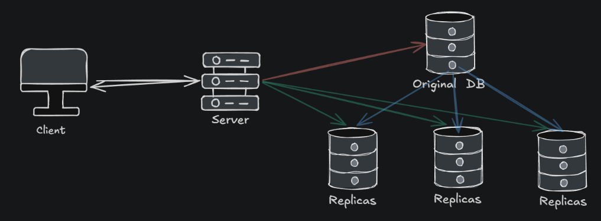
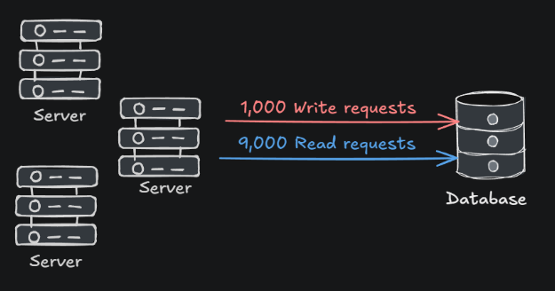
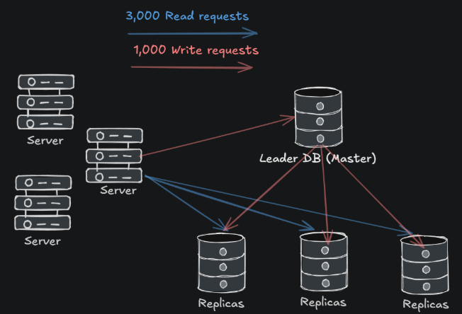
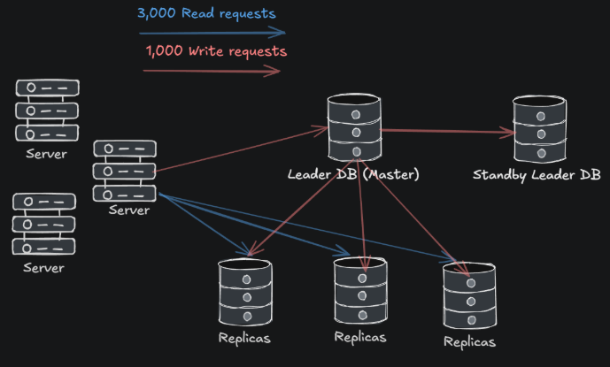
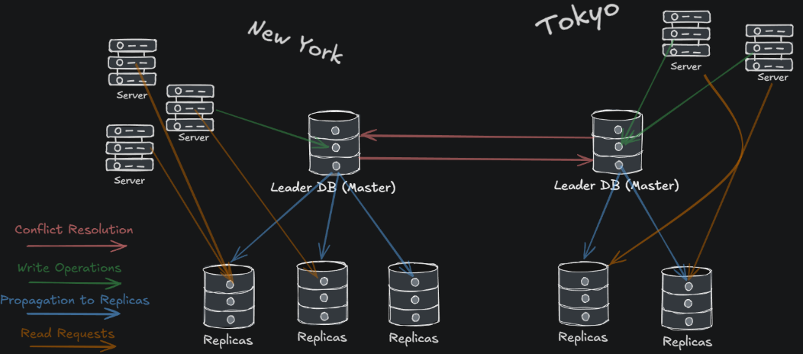
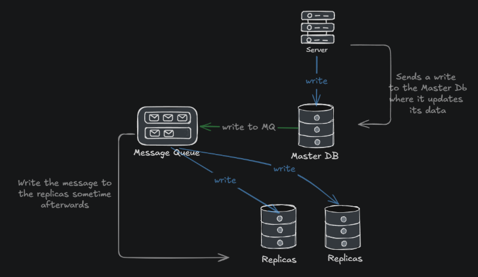
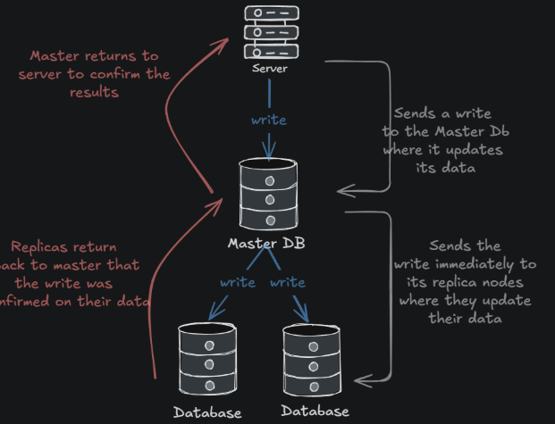
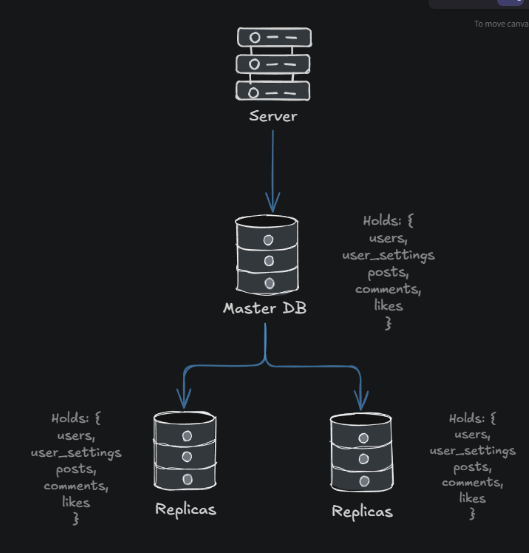
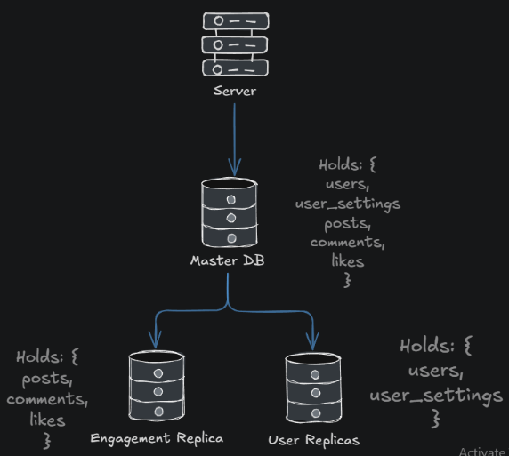
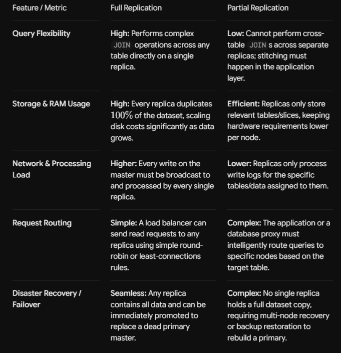

[← Back to all topics](../index.md)

# Replication

**Code:** [github.com/yourusername/cap-theorem-demo](#) _(replace with your real repo link)_

A dependency-free simulation demonstrating replication with the theory behind it.

# Theory

Database replication is the process of keeping multiple copies of the same data in different servers (replicas) so that if one server goes down, other servers can continue to serve data without interruption or downtime.

However plenty of issues are brought up when looking at this type of infrastructure. If we have a main database, and there needs to be constant dumps into the replicas, then the replicas will have inaccurate information because you can only do write operations to the original database. If there was an update you would have to wait for the original DB to propagate to the other replicas.

This is where replication techniques solve the problems.

- Provides <u>high performance</u>, <u>availability</u>, and <u>reliability</u>
- <u>Efficient</u> - If the data between the replicating databases does not change over time, then replication is easy because we just need to copy the data to every other node

There are 3 types of database replications

## Single-Leader Architecture

This is also known as **Master-Slave** or active-passive replication.
Here there is a single leader (master) and several follower replicas (slaves). All write requests are handled by the leader node and all the read requests are handled by the leader and follower nodes. It would be best to use the leader only for write requests and the followers for read requests. This will remove load from the leader.

After serving the write request, the leader node sends a stream of data changes to the follower nodes to update their current state of data.

This works best if you have a lot of read to write request ratio in a system. Let's say we have the following as an example:

- The payload on the database means it needs to take in 10,000 requests and read through all of them. To make this simpler we can incorporate replicas:

- Note: In this example the writes are done synchronously through event driven jobs. It could be also the case that it could be done asynchronously through a schedule driven job. We will talk more about asynchronous and synchronous replication beneath.

With this system, the leader handles 1,000 write requests, and distributes these to the replicas. And the follower (slave) replicas handle 3,000 read requests + 1,000 write requests. We minimized the request per database from 10,000 to 4,000.

### Advantages/Disadvantages

<u>**Advantages**</u>

- **High read throughput** - Spreads read across multiple replica nodes.
- **High availability for reads** - if a replica dies, other replicas or the leader, can take its place
- **Fault Tolerance** - If the leader node fails, a slave follower can take its place following the passive-active mechanism

<u>**Disadvantages**</u>

- **Replication Lag** - Asynchronous updates mean replicas can briefly serve stale data to users reading immediately after a write. Also similar to the eventual system consistency, propagation introduces a level of complexity, as well as data might not be accurate
- **Write Bottleneck** - All writes must flow through the master node, limiting the total write throughput
- **Failover Complexity** - failover risks split-brained decisions when the leader fails you would need to decide which replica node gets to take the role of leader. Let's say one replica node is way more accurate then the other replicas data wise.

**Hot Standby** - A way to fix the failover complexity, in case the leader database fails, you can set up an identical or almost identical leader on standby that can take its place.

- This standby leader shadows the leader in case of a failure. Only cons to this is it requires spending on a server that does not do anything unless a failure happens.

### When to Use

**High read:write ratio** - E-commerce stores, social media feeds, management platforms, or news sites where users consume far more data than they post.
**Acceptable Stale Reads** - Workloads that can afford eventual consistency.
Although between master-slave and master-master, master-slave can offer strong consistency if configured correctly. Called Synchronous Master-Slave

## Multi-Leader Architecture

There are 2 problems with Single-Leader design.

1. Lets say we have client users in tokyo, but our database is located in new york. The server would need to contact the database in New York and send it back to Tokyo to return to the client.
2. Another problem is lets say we have 10,000 writing requests/sec for the leader database. It would require help.

It does this by creating another master database that has its own replicas. The difficult part about master-master is because you have 2 master databases that accept write functions, you would have 2 clients writing differing data to both and as a result you would have 2 master databases with differing opinions about the data. Because of this you would need to introduce some sort of conflict resolution mechanism to resolve the differences.
The conflict resolution mechanism is usually done instantly after the write has happened to the leader Database.

### Advantages/Disadvantages

<u>**Advantages**</u>

- **Global Low Latency** - Users write to the geographically closest Leader Database with sub-millisecond local response times
- **High Write Availability** - If one leader node goes down, you can traffic load to a differing leader
- **Horizontal Write Scaling** - Total write capacity is multiplied by distributing write loads across multiple active leader servers

<u>**Disadvantages**</u>

- **Complex Conflict Resolution** - Concurrent writes to different leaders require automated strategies to resolve collisions
- **Eventual Consistency** - Replicas and remote leaders (leaders in a different geographic location) lag behind, meaning users in different regions might temporarily see different data

### When to use

**Geographically** - When you have users spread across the globe
**High write operations** - When your system receives a lot of writes per second, the CPU I/O physically cannot keep up.
**Fault Tolerance** - If there is a failure to one of the master databases and you can’t afford it being down, you can have a differing database take its place.

## Replications

### Asynchronous Replication

A type of Eventual Consistent mechanism. In this strategy, the leader node responds to the client after updating its own copy of the data WITHOUT waiting for the changes to be propagated to the followers.

<u>Advantages</u> - Its fast because you get writing confirmation instantly and then you can move on.  
<u>Disadvantages</u> - Can have replica nodes with the incorrect data.

### Synchronous Replication

A type of Strong Consistency mechanism. Once the leader updates its own data, it initiates the write operation on its followers. Followers receive the update, apply the change to their own copy of the data and send confirmation to the leader that it was successful. Once the leader receives the information from its followers it returns to the client.
This ensures that all the replica nodes are in sync.

<u>Advantages</u> - here your data is consistent and strong.  
<u>Disadvantages</u> - Have to wait for all the replica nodes to be propagated before you can continue with any other request.

### Full Replication

In this method, we copy the entire original database at every replica. This makes reads very responsive because you can pull data from any replica node. Only issue is you would need to update every replica with the same information

### Partial Replication

In partial replication only a partial amount of the data is given to the replica nodes. This makes the type of data being replicated the important part. Here updating the replica nodes is fast, however because you divide the data to different nodes, you can have an increase in execution time

### Advantages/Disadvantages to Full vs Partial

## Watching it run

## What this demonstrates
